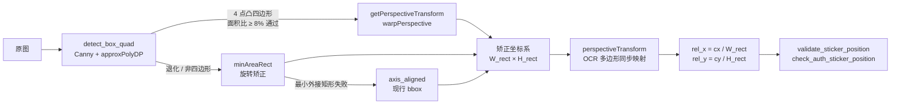

# 多 LOB 封口贴检测逻辑说明

## 一、LOB 总览

系统需要支持以下 6 类产品线（LOB），每类的封口贴数量和规范位置不同：


| LOB     | 贴纸数量  | 一贴（扫码即领）              | 二贴（Apple授权专营店）        | 包装盒特征    | 颜色检测模式 |
| ------- | ----- | --------------------- | ---------------------- | -------- | ----------- |
| iPhone  | 1 或 2 | 右上角                   | 右下角                    | 白色方盒，竖向  | `white_box` |
| Watch   | 1 或 2 | 沿盒子中轴线 **顶端 或 底端**（对称） | 沿盒子中轴线 **顶端 或 底端**（对称） | 白色窄长盒，竖向 | `white_box` |
| AirPods | 1     | 右上角                   | 无                      | 白色小方盒    | `white_box` |
| Accy.   | 1     | 右上角                   | 无                      | 白色小方盒    | `white_box` |
| iPad    | 1 或 2 | 右上角                   | 右下角                    | 白色大扁盒，横向 | `white_box` |
| Mac     | 1 或 2 | 底部居中                  | 上方靠左侧                  | 棕色瓦楞纸箱   | `brown_box` |

> LOB 枚举严格对齐 Excel `LOB` 列的原始字符串：`iPhone / Watch / AirPods / Accy. / iPad / Mac`，
> 代码中的 `LOB_CONFIGS` key 与 README 小节标题必须与此一致。


贴纸样式说明：

- 一贴（扫码即领）：印有"扫码即领 1000 + ¥500 会员积分 优惠券包"及 QR 码
- 二贴（Apple授权专营店）：印有"Apple 授权专营店 在你身边"
- 所有 LOB 的贴纸样式相同，仅粘贴位置不同

---

## 二、各 LOB 位置规范定义

所有坐标均为包装盒相对坐标系（左上角为原点，右下角为 (1.0, 1.0)）。

### 2.1 iPhone（现有逻辑，保持不变）

```
包装盒坐标系（背面朝上）：

    0%           50%    95%
    ├────────────┼──────┤  ← 0%
    │            │▓▓▓▓▓▓│  ← 一贴（扫码即领）
    │            │▓▓▓▓▓▓│  ← 30%
    │            ├──────┤
    │            │      │
    │  包装盒背面 │      │
    │            │      │
    │            ├──────┤  ← 70%
    │            │░░░░░░│  ← 二贴（Apple授权专营店）
    └────────────┴──────┘  ← 100%
```


| 贴纸             | rel_x 范围     | rel_y 范围     | 说明                       |
| -------------- | ------------ | ------------ | ------------------------ |
| 一贴（扫码即领）       | [0.50, 0.95] | [0.00, 0.30] | 右侧 50%~~95%，顶部 0%~~30%   |
| 二贴（Apple授权专营店） | [0.50, 0.95] | [0.70, 1.00] | 右侧 50%~~95%，底部 70%~~100% |


双贴规则：

- 可单贴（仅一贴） → 合规
- 双贴时二贴必须在规范位置 → 否则不合规
- 不允许出现两张"扫码即领"贴纸

---

### 2.2 Watch

Watch 盒子为竖向窄长盒（约 2:1 ~ 2.5:1 长宽比），上下各有一个开口需要封住。
封口贴沿盒子**中轴线**贴合、绕折到两侧面，业务约束：

- **单贴**：贴在盒子"顶端"**或**"底端"任一位置均视为合规（业务允许对称位置）
- **双贴**：一张顶端 + 一张底端
- **x 方向不作硬约束**——原因有两点：
  1. 长条盒的透视矫正/旋转矫正稳定性较弱，矫正后相对坐标的 x 方向误差较大
  2. 业务关键判据是 y 位置（贴纸是否落在盒子顶端 / 底端），x 位置由矫正误差主导、不 reliable

```
包装盒坐标系（背面朝上，矫正后竖放）：

    0%            50%            100%
    ├─────────────┼─────────────┤  ← 0%
    │                           │
    │       ▓▓▓▓▓▓▓▓▓▓▓         │
    │       ▓▓ 扫码即领/Apple授权 │ ← 一贴（顶端，y ∈ [0.00, 0.45]）
    │       ▓▓▓▓▓▓▓▓▓▓▓         │
    │                           │  ← 45%
    │     （中段无贴纸区）         │
    │                           │  ← 55%
    │       ░░░░░░░░░░░         │
    │       ░░ 扫码即领/Apple授权 │ ← 二贴（底端，y ∈ [0.55, 1.00]）
    │       ░░░░░░░░░░░         │
    │                           │
    └───────────────────────────┘  ← 100%
```


| 贴纸 / 区域                       | rel_x 范围       | rel_y 范围     | 说明                |
| ----------------------------- | -------------- | ------------ | ----------------- |
| 顶端区域（扫码即领 或 Apple授权专营店 任一）  | 不约束            | [0.00, 0.45] | y 方向靠上，贴住上开口      |
| 底端区域（扫码即领 或 Apple授权专营店 任一）  | 不约束            | [0.55, 1.00] | y 方向靠下，贴住下开口      |


> **多合规区域（list[dict]）**：Watch 的 `scan_sticker` / `auth_sticker` 在
> `LOB_CONFIGS` 中都配置为**两个 y 区域的列表**，贴纸中心落在任一区域均视为合规。
> 所有区域都只约束 y、不约束 x。


双贴规则：

- 可单贴（仅一贴） → 合规（单贴可出现在**顶端或底端**任一位置）
- 双贴时二贴必须在规范位置 → 否则不合规
- 不允许出现两张"扫码即领"贴纸

---

### 2.3 AirPods

AirPods 盒子较小，仅需一张封口贴。贴纸位置在背面右上角。

```
包装盒坐标系（背面朝上）：

    0%           50%    95%
    ├────────────┼──────┤  ← 0%
    │            │▓▓▓▓▓▓│  ← 一贴（扫码即领）
    │            │▓▓▓▓▓▓│  ← 50%
    │            ├──────┤
    │            │      │
    │  包装盒背面 │      │
    │            │      │
    │            │      │
    └────────────┴──────┘  ← 100%
```


| 贴纸       | rel_x 范围     | rel_y 范围     | 说明                     |
| -------- | ------------ | ------------ | ---------------------- |
| 一贴（扫码即领） | [0.50, 0.95] | [0.00, 0.50] | 右侧 50%~~95%，顶部 0%~~50% |
| 二贴       | 无            | 无            | AirPods 无二贴            |


双贴规则：

- **仅单贴**，不需要二贴
- 若检测到"Apple授权专营店"贴纸 → 忽略（不作为错误）
- 不允许出现两张"扫码即领"贴纸

---

### 2.4 原厂配件（Accy.）

原厂配件盒子较小（如 20W USB-C 充电器），与 AirPods 相同，仅需一张封口贴在右上角。

```
包装盒坐标系（背面朝上）：

    0%           50%    95%
    ├────────────┼──────┤  ← 0%
    │            │▓▓▓▓▓▓│  ← 一贴（扫码即领）
    │            │▓▓▓▓▓▓│  ← 50%
    │            ├──────┤
    │            │      │
    │  包装盒背面 │      │
    │            │      │
    └────────────┴──────┘  ← 100%
```


| 贴纸       | rel_x 范围     | rel_y 范围     | 说明                     |
| -------- | ------------ | ------------ | ---------------------- |
| 一贴（扫码即领） | [0.50, 0.95] | [0.00, 0.50] | 右侧 50%~~95%，顶部 0%~~30% |
| 二贴       | 无            | 无            | 原厂配件无二贴                |


双贴规则：与 AirPods 完全相同。

---

### 2.5 iPad

iPad 盒子为大扁盒（横向或竖向），一贴在背面右上角，二贴在背面右下角。布局与 iPhone 相同。

```
包装盒坐标系（背面朝上）：

    0%           50%    95%
    ├────────────┼──────┤  ← 0%
    │            │▓▓▓▓▓▓│  ← 一贴（扫码即领）
    │            │▓▓▓▓▓▓│  ← 30%
    │            ├──────┤
    │            │      │
    │  包装盒背面 │      │
    │            │      │
    │            ├──────┤  ← 70%
    │            │░░░░░░│  ← 二贴（Apple授权专营店）
    └────────────┴──────┘  ← 100%
```


| 贴纸             | rel_x 范围     | rel_y 范围     | 说明                       |
| -------------- | ------------ | ------------ | ------------------------ |
| 一贴（扫码即领）       | [0.50, 0.95] | [0.00, 0.30] | 右侧 50%~~95%，顶部 0%~~30%   |
| 二贴（Apple授权专营店） | [0.50, 0.95] | [0.70, 1.00] | 右侧 50%~~95%，底部 70%~~100% |


双贴规则：与 iPhone 完全相同。

---

### 2.6 Mac

Mac 使用棕色瓦楞纸外箱包装，贴纸位置与其他 LOB 差异较大：

- 一贴在盒子底部居中位置
- 二贴在盒子上方靠左侧

```
包装盒坐标系（背面朝上）：

   0%  5%       50%          100%
    ├──┼─────────┼────────────┤  ← 0%
    │  │░░░░░░░░ │            │  ← 二贴（Apple授权专营店）
    │  │░░░░░░░░ │            │  ← 30%
    │  ├─────────┤            │
    │  │         │            │
    │  │  盒子中部│            │
    │  │         │            │
    ├──┼─────────┼────────────┤  ← 70%
    │  │     25% │ 75%        │
    │  │      ▓▓▓▓▓▓▓▓        │  ← 一贴（扫码即领）
    └──┴─────────┴────────────┘  ← 100%
```


| 贴纸             | rel_x 范围     | rel_y 范围     | 说明                         |
| -------------- | ------------ | ------------ | -------------------------- |
| 一贴（扫码即领）       | [0.25, 0.75] | [0.70, 1.00] | 水平居中 25%~~75%，底部 70%~~100% |
| 二贴（Apple授权专营店） | [0.05, 0.50] | [0.00, 0.30] | 左侧 5%~~50%，顶部 0%~~30%      |


双贴规则：

- 可单贴（仅一贴） → 合规
- 双贴时二贴必须在规范位置 → 否则不合规
- 不允许出现两张"扫码即领"贴纸

注意：Mac 的包装盒为棕色瓦楞纸箱，与白色盒子差异显著。
颜色检测采用专用 `brown_box` 模式（§3、§5.1），基于「排除棕 + 排除白 + 绝对饱和度」
三条件识别非官方贴纸，不再复用白盒的白平衡归一化分支。

---

## 三、各 LOB 检测参数汇总表

```
全局绕折容差（影响所有 LOB 的 scan_sticker / auth_sticker 位置判定）：

STICKER_POSITION_TOLERANCE = 0.15   # 相对坐标系容差

  说明：封口贴物理上跨越盒面与侧面/顶面/底面，OCR 识别"扫码即领" /
  "Apple授权专营店"的文字中心点经过透视矫正后，常溢出盒面边界 5%~15%。
  位置校验时在每个规范区域四周统一放宽 ±0.15，避免合规的正常绕折贴纸被误判。


LOB 配置字典结构（Python 伪代码）：

LOB_CONFIGS = {
    "iPhone": {
        "sticker_count": "single_or_dual",       # 单贴或双贴均可
        "scan_sticker": {                         # 一贴（扫码即领）—— 单区域 dict 写法
            "x_min": 0.50, "x_max": 0.95,
            "y_min": 0.00, "y_max": 0.30,
        },
        "auth_sticker": {                         # 二贴（Apple授权专营店）
            "x_min": 0.50, "x_max": 0.95,
            "y_min": 0.70, "y_max": 1.00,
        },
        "unofficial_color": {
            "enabled": True,
            "mode": "white_box",                  # 白平衡归一化 + 相对饱和度
            "sat_above_bg": 55,                   # 归一化后饱和度下限
            "val_range": (40, 230),
            "area_ratio": 0.015,
            "solidity_min": 0.45,
            "edge_grad_min": 6.0,
        },
    },
    "Watch": {
        "sticker_count": "single_or_dual",
        # 多区域 list[dict] 写法：封口贴可在"顶端"或"底端"任一位置；
        # x 方向不设约束（长条盒矫正稳定性弱，关键判据是 y）。
        "scan_sticker": [
            {"y_min": 0.00, "y_max": 0.45},
            {"y_min": 0.55, "y_max": 1.00},
        ],
        "auth_sticker": [
            {"y_min": 0.00, "y_max": 0.45},
            {"y_min": 0.55, "y_max": 1.00},
        ],
        "unofficial_color": { "enabled": True, "mode": "white_box",
                              ... (阈值同 iPhone) ... },
    },
    "AirPods": {
        "sticker_count": "single_only",           # 仅单贴
        "scan_sticker": {"x_min": 0.50, "x_max": 0.95,
                         "y_min": 0.00, "y_max": 0.50},
        "auth_sticker": None,                     # 无二贴
        "unofficial_color": { "enabled": True, "mode": "white_box",
                              ... (阈值同 iPhone) ... },
    },
    "Accy.": {                                    # 原厂配件
        "sticker_count": "single_only",
        "scan_sticker": {"x_min": 0.50, "x_max": 0.95,
                         "y_min": 0.00, "y_max": 0.50},
        "auth_sticker": None,
        "unofficial_color": { "enabled": True, "mode": "white_box",
                              ... (阈值同 iPhone) ... },
    },
    "iPad": {
        "sticker_count": "single_or_dual",
        "scan_sticker": {"x_min": 0.50, "x_max": 0.95,
                         "y_min": 0.00, "y_max": 0.30},
        "auth_sticker": {"x_min": 0.50, "x_max": 0.95,
                         "y_min": 0.70, "y_max": 1.00},
        "unofficial_color": { "enabled": True, "mode": "white_box",
                              ... (阈值同 iPhone) ... },
    },
    "Mac": {
        "sticker_count": "single_or_dual",
        "scan_sticker": {"x_min": 0.25, "x_max": 0.75,
                         "y_min": 0.70, "y_max": 1.00},
        "auth_sticker": {"x_min": 0.05, "x_max": 0.50,
                         "y_min": 0.00, "y_max": 0.30},
        "unofficial_color": {
            "enabled": True,
            "mode": "brown_box",                   # 棕盒专用：排除棕+排除白+绝对饱和度
            "brown_hue_range": (5, 30),            # OpenCV H:0~180°
            "brown_sat_min": 30,
            "brown_val_range": (40, 200),
            "white_sat_max": 30,                   # 官方白贴 + 强反光上限
            "white_val_min": 200,
            "sat_min_abs": 80,                     # 无白参考，改用绝对饱和度阈
            "val_range": (50, 240),
            "area_ratio": 0.015,
            "solidity_min": 0.45,
            "edge_grad_min": 6.0,
        },
    },
}
```

`scan_sticker` / `auth_sticker` 两种写法：

- **`dict`（单区域）**：`{x_min, x_max, y_min, y_max}`，用于 iPhone/iPad/AirPods/Accy./Mac 等
  单一合规位置的 LOB；四个字段任一缺省视为该侧不约束。
- **`list[dict]`（多区域，任一即可）**：贴纸中心落在列表里**任一**区域均视为合规。
  Watch 使用此写法，同时声明"顶端"与"底端"两个合规 y 区间。

`sticker_count` 三种取值：

- `single_only`：仅单贴（AirPods / Accy.）。忽略可能出现的 Auth 关键词，两张扫码仍不合规。
- `single_or_dual`：单贴或双贴均可（iPhone / Watch / iPad / Mac）。当前默认行为。
- `dual_required`：必须双贴（保留扩展口径）。缺二贴时 `dual_code=3`。

---

## 四、检测流程（多 LOB 改进版）

改进后的 `process_row` 在现有流程基础上新增两步：**LOB 识别**（Phase 0）与
**包装盒透视矫正**（Phase 2.5）。矫正后的坐标系把贴纸位置换算为与拍摄角度、
盒子物理尺寸无关的相对坐标，从而能用同一套阈值覆盖不同 LOB 的多个版本。

```
订单（1~4 张图片）
 │
 ├─ Phase 0  识别 LOB（严格模式，只认 Excel LOB 列）
 │           读取 row["LOB"]，与 LOB_CONFIGS key strip+精确匹配
 │           命中 → 进入 Phase 1
 │           未命中（缺失 / NaN / 不在枚举）→ 输出列写 "UNKNOWN LOB"，
 │           直接标记不合格并 return（不再跑 OCR，不再用 iPhone 兜底）
 │
 ├─ Phase 1  遍历所有图片
 │           每张做 OCR + detect_box_bbox(lob=...)（按 LOB 分白/棕盒策略 2）
 │             → 正向完整判断
 │           符合条件者记入 candidates（不在此阶段做颜色检测，避免无效开销）
 │
 ├─ Phase 2  取盒子占比最大的候选图
 │
 ├─ Phase 2.5  包装盒透视矫正（三级降级，见下方 mermaid）
 │             rectify_package_box(image, lob=...)
 │               → warped_img / M / (W_rect, H_rect) / method / box_quad_src
 │             策略 1/2 不分 LOB，策略 3（axis_aligned 兜底）按 LOB 调用
 │             detect_box_bbox(lob=...) 分流白/棕盒阈值
 │             通过 cv2.perspectiveTransform 把原图 OCR 多边形映射到矫正坐标系
 │             无 M（axis_aligned 兜底）时退化为现有 (rel = (cx-box_x)/box_w) 公式
 │
 ├─ Phase 2.6  主贴选择（LOB-aware，见 §5.5）
 │             find_all_scan_stickers(texts, polys_rect) → scan_candidates
 │             pick_best_scan_sticker(scan_candidates, W_rect, H_rect,
 │                                    LOB.scan_sticker) → sticker_rect
 │             按"到规范矩形的外距离"选主贴，避免多贴/背景印刷/OCR 顺序偏差
 │
 ├─ Phase 3  单贴检测（基于矫正坐标系 + LOB 配置）
 │             Step 0  非官方贴纸颜色检测（按 mode 分流，命中硬判 position_valid=4）
 │             Step 1  位置验证 ← LOB.scan_sticker
 │             Step 2  角度验证（矫正后 box_angle=0 由构造保证）
 │             Step 3  平铺检测
 │
 └─ Phase 4  双贴检测（根据 sticker_count 决定行为）
               ┌─ single_only       → 忽略 Auth；两张扫码仍不合规
               ├─ single_or_dual    → has_auth 则验证二贴位置；单贴亦合规
               └─ dual_required     → 缺二贴 dual_code=3（保留扩展口径）
```

### 4.1 包装盒矫正三级降级管线



> 动机：Watch / Mac 等版本迭代会改变盒子物理尺寸；斜视/旋转拍摄会让轴对齐 bbox
> 把桌面背景纳入，导致 `rel_x / rel_y` 严重失真。统一矫正为正视矩形后，贴纸相对
> 位置仅依赖于 LOB 规范，不再受拍摄姿态影响。

---

## 五、各 LOB 特殊注意事项

### 5.1 Mac 包装盒白/棕盒分流（box detect + 非官方贴纸颜色检测）

Mac 使用棕色瓦楞纸箱，在两个环节都需要区别于其他 LOB：

#### 5.1.1 `detect_box_bbox` 的策略 2 分流

包装盒轮廓检测的三级降级：

| 策略 | 实现                     | 分 LOB？             |
| --- | ----------------------- | -------------------- |
| 1   | Canny + approxPolyDP    | 不分（纯边缘，通用）   |
| **2** | **颜色区域阈值**         | **按 LOB 分流**        |
| 3   | 整图 fallback            | 不分                 |

策略 2 的分支：

```python
if lob == "Mac":
    # 棕盒：HSV 范围抠棕色
    thresh = cv2.inRange(hsv, BROWN_HSV_LOW=(5,30,40),
                              BROWN_HSV_HIGH=(30,200,220))
    # 再走闭运算 + 开运算消除瓦楞条纹空洞
    method = 'brown'
else:
    # 白盒（iPhone / iPad / Watch / AirPods / Accy.）
    _, thresh = cv2.threshold(filtered, 190, 255, cv2.THRESH_BINARY)
    method = 'bright'
```

**动机**：白盒策略用灰度阈值 `>190` 抓白色像素，对棕盒会几乎无效（棕色灰度在 60~120 之间），
只剩 fallback 整图兜底，`rel_x / rel_y` 就会严重失真。
按 LOB 分流后，Mac 的策略 2 直接命中棕色区域，`包装盒检测方式` 列输出 `brown`。

#### 5.1.2 `detect_unofficial_sticker_color` 的 `brown_box` 分支

白盒算法的前提「白背景 S≈0，彩色块为异常」在棕盒上不成立：

- 棕色本身 S≈50~120、H∈[5°,30°]，白平衡采样退化为 `bg_sat_ref=0.0`，归一化失效
- **官方白色封口贴**在棕盒上是饱和度最低的区域，白盒逻辑会直接把它误判为异常
- 简单「非棕 = 非官方」启发式也不成立（官方白贴本身就不是棕色）

因此 Mac 使用独立的 `brown_box` 分支，按「非棕 ∩ 非白 ∩ 高饱和」三条件
定位异色区，再复用白盒分支相同的 morphology + 连通区 + solidity + 边缘梯度
过滤段：

```python
def _detect_brown_box(zone, cfg):
    hsv = cv2.cvtColor(zone, cv2.COLOR_BGR2HSV)
    h, s, v = cv2.split(hsv)

    # 1) 棕色背景掩码（盒面自身）
    brown_mask = (
        (h >= cfg["brown_hue_range"][0]) & (h <= cfg["brown_hue_range"][1]) &
        (s >= cfg["brown_sat_min"]) &
        (v >= cfg["brown_val_range"][0]) & (v <= cfg["brown_val_range"][1])
    )
    # 2) 白色官方贴纸 + 强反光掩码
    white_mask = (s <= cfg["white_sat_max"]) & (v >= cfg["white_val_min"])
    # 3) 异色候选：非棕 ∩ 非白 ∩ 绝对饱和度
    foreign = (
        (~brown_mask) & (~white_mask) &
        (s >= cfg["sat_min_abs"]) &
        (v >= cfg["val_range"][0]) & (v <= cfg["val_range"][1])
    )
    # 4) 后段复用白盒：morphology → CC → solidity_min → edge_grad_min → area_ratio
```

所有 LOB 在 `enabled=True` 时，颜色命中仍然硬判 `position_valid=4`，
保持硬判语义一致。若需运营上先软标记观察，可在 `LOB_CONFIGS` 中关闭 `enabled`
逐 LOB 灰度放开。

### 5.2 Watch 双封口

Watch 的上下封口贴纸起到物理封口作用。双贴规则与 iPhone 一致：
可单贴合规，双贴时二贴必须在规范位置。

### 5.3 AirPods / 原厂配件 简化流程

由于这两类 LOB 仅需一张贴纸，可完全跳过：

- 双贴纸状态检测（`check_dual_sticker_status`）
- Auth 贴纸位置验证（`check_auth_sticker_position`）
- 检测到 Auth 贴纸时不触发任何合规判定

### 5.4 iPad 与 iPhone 规则复用

iPad 的贴纸位置规范与 iPhone 完全一致（右上 + 右下），可直接复用相同参数。
区别仅在于包装盒尺寸更大（大扁盒 vs 竖盒），但由于使用相对坐标系，不影响检测逻辑。

### 5.5 多贴场景下的主贴选择（LOB-aware）

**背景问题**：实际订单里存在一贴 / 二贴 / 多贴混合的场景，同一张图可能有
多个 OCR 命中"扫码即领"（两张封口贴 / 背景印刷 / 副贴残留）。旧实现
`find_sticker_from_ocr = stickers[0]` 按 OCR 顺序取第 1 个，
顺序与空间位置无关，遇到"副贴/背景文字比主贴靠前"时会把错误坐标
喂给后续位置验证，直接误判 `position_valid`。

**新实现**：Phase 2.6 在矫正坐标系下按 LOB 规范区域打分。

```python
def pick_best_scan_sticker(scan_stickers, W_rect, H_rect, scan_position_cfg):
    """
    scan_position_cfg 直接用 LOB_CONFIGS[lob]["scan_sticker"]。
    对每个候选：
      rel_x = cx / W_rect,  rel_y = cy / H_rect
      dist  = 到规范矩形 [x_min,x_max]×[y_min,y_max] 的外距离
              （落入矩形内 → 0；落外 → 欧氏距离到边/角）
    主键 dist 升序；平手时副键 rel_y 升序（更靠上优先，符合
    iPhone/iPad/AirPods/Accy. 右上 = 太阳码贴的业务共识；
    Mac 等底部 LOB 在"全部落入区内"场景副键不会破坏正确性）。
    """
```

**LOB 差异自然落在 cfg 里**（不需要为每个 LOB 写分支）：

| LOB           | 规范区域 (rel_x, rel_y)                                                 | 主贴通常被选中的位置         |
| ------------- | --------------------------------------------------------------------- | ------------------------ |
| iPhone / iPad | x 0.50\~0.95，y 0.00\~0.30                                             | 右上角                   |
| AirPods / Accy. | x 0.50\~0.95，y 0.00\~0.50                                           | 右上偏中                 |
| Watch         | y 0.00\~0.45 **或** y 0.55\~1.00（x 不约束；多区域 list[dict]）              | 顶端或底端                |
| Mac           | x 0.25\~0.75，y 0.70\~1.00                                             | 底部居中                 |

> 所有区域在位置校验时统一叠加 **±0.15 绕折容差**（§5.6）。
> `_scan_sticker_distance_to_zone` 对 `list[dict]` 取"到最近区域"的距离，
> 因此 Watch 多区域不会影响选贴算法的合规判定一致性。

**兜底行为**：

- `scan_candidates` 为空 → 返回 `None`（Phase 3 走原"OCR 二次定位失败"分支）
- `W_rect / H_rect ≤ 0` 或 `scan_position_cfg is None` → 退化为 `scan_stickers[0]`，
  保持与旧实现一致的行为兜底
- 多候选时主流程会打印一条日志：
  `'扫码即领'候选 N 个，按 LOB=xxx 规范区域选中 text_idx=...`，
  便于跑批后复盘选贴决策

**影响面**：`find_sticker_from_ocr` 保留作为向下兼容 API，
docstring 标注"已被 `pick_best_scan_sticker` 替代"，
主流程 `process_row` 在 Phase 2.6 统一走新函数。

### 5.6 位置校验：绕折容差 & 多区域

#### 5.6.1 绕折容差（`STICKER_POSITION_TOLERANCE = 0.15`）

**背景**：封口贴物理上跨越盒面与侧面/顶面/底面——贴纸不只贴在"盒面"上，
而是绕过盒子边缘封住开口。OCR 识别"扫码即领"/ "Apple授权专营店"时拿到的是
文字多边形中心，文字本身可能印在贴纸的绕折部分上。经过透视矫正后：

- iPhone/iPad 等方盒的封口贴在右上角，文字中心常 `rel_x ∈ [0.95, 1.15]`（绕到右侧面）
- 或 `rel_y ∈ [-0.10, 0.00]`（绕到顶面）

为避免把正常绕折的合规贴纸误判为"位置异常"，`validate_sticker_position`
在每个规范区域四周**统一放宽 ±0.15**：

```python
x_lo, x_hi = x_min - 0.15, x_max + 0.15
y_lo, y_hi = y_min - 0.15, y_max + 0.15
x_ok = x_lo <= rel_cx <= x_hi
y_ok = y_lo <= rel_cy <= y_hi
```

容差值定义在 `ocr_batch_process_v2.py` 顶部常量
`STICKER_POSITION_TOLERANCE`，对 `scan_sticker` 与 `auth_sticker`
同时生效；若需要针对个别场景单独调整，可在调用
`validate_sticker_position(..., tolerance=...)` 时传参覆盖。

#### 5.6.2 多合规区域（`list[dict]`）

`scan_sticker` / `auth_sticker` 除了传统的 `dict` 单区域写法外，
还支持 `list[dict]` —— **命中任一区域即视为合规**。

使用场景：**Watch**（§2.2）。业务允许单贴贴在盒子"顶端"或"底端"任一位置，
因此 Watch 同时声明两个 y 区间：

```python
"scan_sticker": [
    {"y_min": 0.00, "y_max": 0.45},   # 顶端
    {"y_min": 0.55, "y_max": 1.00},   # 底端
],
```

内部实现：

- `_normalize_position_cfg(cfg)` 把 `None / dict / list[dict]` 统一成"区域列表"
- `validate_sticker_position` 逐个区域校验；命中任一即返回 `in_correct_position=True`；
  全部失败时用"命中轴数最多"的区域做 `detail` 解释，减少噪音
- `_scan_sticker_distance_to_zone` 取到所有区域距离的最小值，保证
  `pick_best_scan_sticker` 选贴策略与多区域业务语义一致

---

## 六、LOB 识别方式（严格模式）

LOB 的**唯一权威来源**是输入 Excel 的 `LOB` 列，枚举：
`iPhone / Watch / AirPods / Accy. / iPad / Mac`（经 21818 行
`value_counts` 确认覆盖 100%）。

`detect_lob(row)` 只做一步严格匹配：

```python
raw = row.get("LOB", None)
if raw is None or pd.isna(raw):
    return "UNKNOWN LOB"
key = str(raw).strip()
return key if key in LOB_CONFIGS else "UNKNOWN LOB"
```

### 6.1 为什么移除关键词降级

历史版本曾用 `MPN / UPC / 门店名称` 做关键词降级，
但**门店名称里大量出现 `Mac旗舰体验店` / `iPad专柜` / `Apple Watch 配件` 等词**，
会把 iPhone 订单误识别为 Mac/iPad/Watch，走错位置规范导致误判。
关键词降级的误匹配风险远高于"LOB 列缺失"这一小众场景的召回收益，
因此彻底移除。

### 6.2 UNKNOWN LOB 的处理

- 输出列 `识别LOB` 写入字符串 `"UNKNOWN LOB"`
- `是否规范粘贴 = 0`，`封口贴存在 = 0`，`贴纸位置规范 = -1`
- `位置说明` = `"UNKNOWN LOB：Excel LOB 列缺失或不在枚举内，未执行 OCR 检测"`
- **不再跑 OCR / 不再用 iPhone 规则兜底**：避免用错误规则产出"看似合规"的结果
- 运营侧可按 `识别LOB == "UNKNOWN LOB"` 单独筛出这批订单补齐源数据后重跑

---

## 七、输出列扩展

在现有输出列基础上新增（均已写入 CSV / Excel）：


| 列名               | 类型  | 含义                                                                  |
| ---------------- | --- | ------------------------------------------------------------------- |
| `识别LOB`          | 文字  | 产品线（iPhone / Watch / AirPods / Accy. / iPad / Mac / **UNKNOWN LOB**） |
| `包装盒检测方式`        | 文字  | `edge` / `bright`(白盒策略2) / **`brown`(Mac棕盒策略2)** / `fallback`        |
| `矫正方式`           | 文字  | `perspective` / `rotation` / `axis_aligned`（三级降级命中层级）               |
| `包装盒四点坐标`        | JSON | 原图坐标系下盒子 4 角点（TL,TR,BR,BL）；`axis_aligned` 时为空                         |
| `颜色检测已执行`        | 0/1 | 当前 LOB 是否启用了非官方贴纸颜色检测（`unofficial_color.enabled`）                    |
| `颜色检测模式`         | 文字  | `white_box` / `brown_box` / 空（未启用）                                   |
| `贴纸位置规范` 增值 `4`  | int | `4 = 非官方贴纸（颜色检测命中，仍硬判）`                                              |
| `双贴纸状态` 增值 `3`   | int | `3 = 缺失二贴（仅 dual_required 模式下出现）`                                    |


现有列含义不变，但 `position_valid` 和 `dual_code` 的判定标准随 LOB 变化。
`贴纸相对X/Y` 在本版后基于矫正坐标系计算（`rel_cx = cx / W_rect`），
因此在斜视/旋转图片上比原始版本更稳定。

`位置说明` 列新增对容差的显式标注，便于复盘：

- 合规：`"位置规范 (rel_x=0.98, rel_y=0.12, 绕折容差±0.15)"`
- 异常：`"位置异常：X=1.25 不在 [0.5,0.95]±0.15"`
- Watch 多区域异常：`"位置异常 (多区域任一)：Y=0.50 不在 [0.55,1.00]±0.15"`

---

## 八、各 LOB 合规判定逻辑总结

### iPhone / iPad

```
一贴位置合规（右上角）
  AND 角度合规
  AND 未平铺
  AND （无二贴 OR 二贴位置合规（右下角））
  AND 无双扫码错误
  AND 无非官方贴纸
→ 合规
```

### Watch

```
一贴位置合规（盒子"顶端 y∈[0,0.45]" 或 "底端 y∈[0.55,1.00]" 任一；x 不约束）
  AND 角度合规
  AND 未平铺
  AND （无二贴 OR 二贴位置合规（另一端或同样允许顶端/底端）)
  AND 无双扫码错误
  AND 无非官方贴纸
→ 合规
```

### AirPods / 原厂配件

```
一贴位置合规（右上角）
  AND 角度合规
  AND 未平铺
  AND 无非官方贴纸
→ 合规
（跳过所有双贴检测）
```

### Mac

```
一贴位置合规（底部居中）
  AND 角度合规
  AND 未平铺
  AND （无二贴 OR 二贴位置合规（上方靠左））
  AND 无双扫码错误
  AND 无非官方贴纸
→ 合规
```

